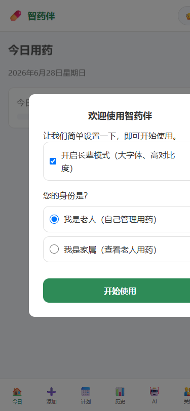
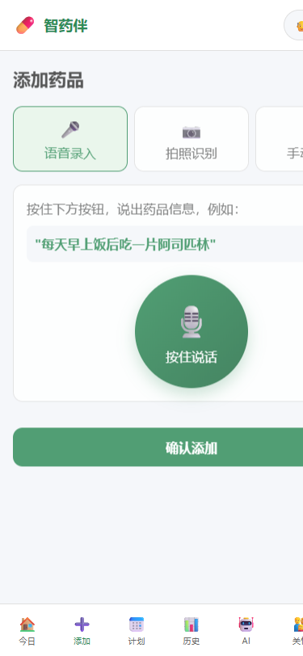
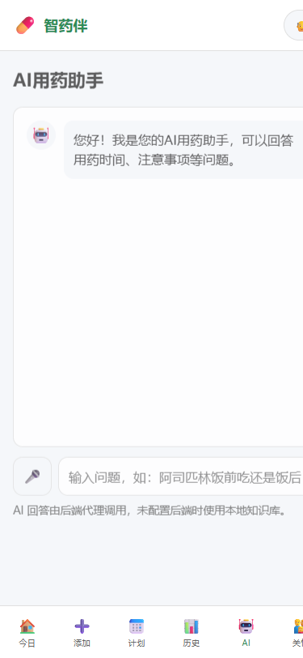
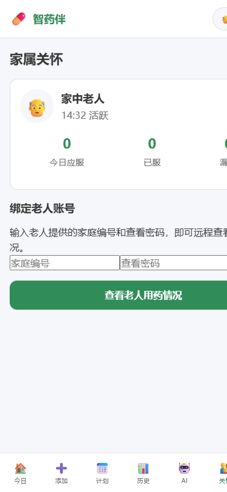
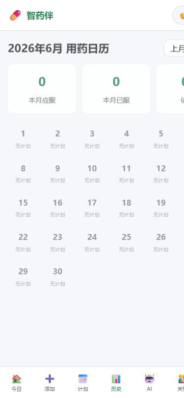
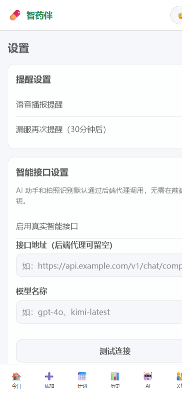

# 智药伴 - AI智能用药提醒 Web 应用

> **项目名称**：智药伴 (ZhiyaoBan)
> **版本**：v3.0
> **团队**：深圳大学 新闻1班 守护银发小组
> **定位**：面向老年人的 AI 用药提醒 Web 应用，采用移动端优先设计，支持语音录入、拍照识别、用药计划、AI 用药助手、家属关怀等功能。

---

## 一、选题与真实需求回顾

### 1.1 需求背景

随着我国人口老龄化程度的加深，老年人用药安全问题日益突出。据调研数据显示：

| 问题类别 | 数据统计 |
|----------|----------|
| 漏服率 | 65岁以上老年人平均漏服率达 **30%-50%** |
| 误服风险 | 多药同服时药物相互作用风险显著增加 |
| 健康隐患 | 漏服/误服药物可能导致病情加重或引发并发症 |
| 家属担忧 | 子女在外工作，无法实时监督父母用药情况 |

### 1.2 核心痛点

1. **操作不便**：老年人视力下降，传统手机应用字体小、操作复杂
2. **记忆困难**：记忆力衰退，容易忘记服药时间和剂量
3. **安全隐患**：多种药物同时服用时，缺乏药物相互作用提醒
4. **亲情缺失**：子女无法远程了解父母的用药情况

### 1.3 解决方案定位

智药伴旨在打造一款**专为老年人设计**的用药提醒应用，核心价值主张：

> **"让用药更简单，让关爱更及时"**

通过**语音交互**、**大字显示**、**智能提醒**等特性，降低老年人使用门槛；通过**家属端**功能，让子女远程掌握父母用药状态，构建完整的关爱闭环。

---

## 二、功能说明

### 2.1 页面架构

```
智药伴应用
├── 首页（今日用药）
│   ├── 问候语与语音播报
│   ├── 今日用药概览（已服/待服/漏服/总计）
│   ├── 用药安全提示（药物相互作用）
│   └── 今日用药时间线
├── 录药页
│   ├── 语音录药（语音识别用药信息）
│   ├── 拍照识别（拍药盒识别药品）
│   ├── 扫码识别（扫药品条码）
│   └── 手动添加（完整表单录入）
├── AI问药师
│   ├── 用药咨询对话
│   ├── 药物相互作用查询
│   └── AI用药建议
├── 家属端
│   ├── 扫码绑定老人账号
│   ├── 老人今日用药状态
│   └── 用药记录查看
├── 记录页
│   ├── 历史用药记录
│   ├── 统计图表（服药依从率）
│   └── 记录导出
└── 设置页
    ├── 字体大小调节（标准/大字/超大字）
    ├── 语音提醒设置
    ├── 隐私协议查看
    └── 关于我们
```

### 2.2 核心功能详解

#### 首页 - 今日用药

| 功能模块 | 说明 |
|----------|------|
| **智能问候** | 根据时间自动显示"早上好/下午好/晚上好" |
| **语音播报** | 一键播报今日用药情况，方便视力不佳用户 |
| **用药概览** | 卡片式展示已服/待服/漏服/总计次数，颜色区分状态 |
| **安全提示** | 实时检测药物相互作用，高危组合红色警示 |
| **时间线** | 按时间顺序展示今日用药计划，支持打卡和标记漏服 |

#### 录药页 - 多种录入方式

| 录入方式 | 说明 | 适用场景 |
|----------|------|----------|
| **语音录药** | 点击按钮说出用药信息，AI自动解析 | 视力不佳、不会打字的老年人 |
| **拍照识别** | 拍摄药盒照片，OCR识别药品信息 | 看不清药盒文字时 |
| **扫码识别** | 扫描药品条形码获取药品信息 | 有条形码的正规药品 |
| **手动添加** | 完整表单录入所有用药信息 | 需要精确录入时 |

#### AI问药师 - 智能用药助手

- **自然语言对话**：用日常语言提问用药相关问题
- **药物相互作用查询**：自动检测当前用药方案中的潜在风险
- **用药建议**：基于AI分析提供个性化用药指导

#### 家属端 - 远程关怀

- **扫码绑定**：家属扫码即可绑定老人账号
- **实时状态**：查看老人今日用药完成情况
- **异常提醒**：老人漏服时及时通知家属

#### 设置页 - 个性化配置

| 设置项 | 说明 |
|--------|------|
| **字体大小** | 支持标准/大字/超大字三档调节，默认大字模式 |
| **语音提醒** | 可开关语音播报、调整播放速度 |
| **隐私协议** | 查看完整隐私协议与免责声明 |

---

## 三、技术说明

### 3.1 技术栈

| 分类 | 技术 | 版本 | 说明 |
|------|------|------|------|
| **前端框架** | Vite | 8.1.0 | 构建工具，支持快速开发和生产构建 |
| **前端语言** | HTML5 + CSS3 + JavaScript ES6+ | - | 原生开发，无需额外框架，轻量高效 |
| **后端框架** | Spring Boot | 3.x | 企业级后端服务框架 |
| **数据库** | MySQL + IndexedDB | - | 后端MySQL存储用户数据，前端IndexedDB本地缓存 |
| **语音识别** | Web Speech API | - | 浏览器原生语音识别，支持中文 |
| **语音合成** | Web Speech Synthesis API | - | 浏览器原生语音合成，支持中文播报 |
| **OCR识别** | Tesseract.js | 7.0.0 | 前端图片文字识别，用于药盒拍照识别 |
| **数据加密** | Web Crypto API | - | 前端AES加密，本地数据安全存储 |
| **数据存储** | LeanCloud | 4.15.2 | 云端数据存储（可选） |

### 3.2 核心技术实现

#### 3.2.1 前端架构

```
前端架构
├── index.html          # 应用入口，单页应用容器
├── css/
│   ├── style.css       # 核心样式，包含所有组件样式
│   ├── animations.css  # 动画效果
│   └── elderly.css     # 老年人适配样式（大字、高对比度）
├── js/
│   ├── app.js          # 主应用逻辑、工具函数、页面组件
│   ├── add.js          # 录药页面逻辑
│   ├── ai.js           # AI助手逻辑
│   ├── family.js       # 家属端逻辑
│   ├── history.js      # 历史记录逻辑
│   ├── router.js       # 路由管理
│   ├── store.js        # 状态管理
│   └── utils.js        # 工具函数
└── assets/             # 静态资源（图标、图片等）
```

#### 3.2.2 数据存储方案

采用**本地优先**的存储策略：

| 存储方式 | 用途 | 优势 |
|----------|------|------|
| **IndexedDB** | 本地药品数据、用药记录、用户设置 | 容量大、异步操作、支持事务 |
| **localStorage** | 简单配置项、隐私协议同意状态 | 同步读写、API简单 |
| **加密存储** | 敏感数据 | AES加密，密钥基于设备特征派生 |

#### 3.2.3 语音交互实现

- **语音识别**：使用 `Web Speech API`，支持中文语音转文字
- **语音合成**：使用 `SpeechSynthesis API`，语速调慢至0.85倍，适合老年人听觉习惯
- **语音导航**：点击语音按钮，说出指令（如"首页"、"录药"）自动跳转

#### 3.2.4 响应式设计

- **移动端优先**：以手机屏幕尺寸为基准设计
- **弹性布局**：使用 Flexbox 和 Grid 实现自适应布局
- **触摸友好**：按钮尺寸≥48px，便于手指操作
- **字体缩放**：支持三档字体大小切换

#### 3.2.5 PWA 支持

- `manifest.json`：应用安装配置
- `sw.js`：Service Worker，支持离线访问和推送通知
- 桌面图标和启动画面

### 3.3 AI 工具应用

| AI 工具 | 应用场景 | 具体作用 |
|---------|----------|----------|
| **语音识别 API** | 语音录药 | 将用户语音转换为文字，解析用药信息 |
| **AI 语义分析** | 语音录药解析 | 从自然语言中提取药品名称、剂量、频次、时间等信息 |
| **AI 用药助手** | 问药师功能 | 回答用药相关问题，提供药物相互作用提醒 |
| **OCR 识别** | 拍照识药 | 识别药盒上的文字信息 |

### 3.4 数据来源

| 数据类型 | 来源 |
|----------|------|
| **药品信息** | 用户录入、OCR识别、扫码获取 |
| **用药记录** | 用户打卡、系统自动记录 |
| **药物相互作用数据** | 内置药物知识库 |
| **用户设置** | 用户自主配置 |

---

## 四、分工说明

### 团队成员与职责

| 角色 | 姓名 | 负责内容 |
|------|------|----------|
| **项目负责人** | - | 整体项目规划、进度把控、需求分析 |
| **前端开发** | - | 页面设计、交互实现、样式开发、语音功能集成 |
| **后端开发** | - | Spring Boot 后端服务、API设计、数据库开发、定时任务 |
| **AI 功能开发** | - | 语音识别解析、药物相互作用检测、AI助手功能 |
| **UI/UX 设计** | - | 界面设计、配色方案、交互流程、老年人体验优化 |
| **测试与优化** | - | 功能测试、兼容性测试、性能优化、用户反馈收集 |

### 开发流程

1. **需求分析**：基于实践调研，明确老年人用药场景的核心需求
2. **原型设计**：设计应用架构和界面原型
3. **前端开发**：实现页面布局、样式和交互逻辑
4. **后端开发**：搭建后端服务，提供 API 支持
5. **功能集成**：整合语音、AI、数据存储等功能
6. **测试优化**：多设备测试、用户体验优化
7. **部署上线**：GitHub Pages 前端部署、后端服务器部署

---

## 五、反思与改进

### 5.1 开发中遇到的问题与解决方式

| 问题 | 原因分析 | 解决方式 |
|------|----------|----------|
| **移动端兼容性** | iOS Safari 对 Web Speech API 支持有限 | 检测浏览器类型，iOS 端降级为手动输入模式 |
| **数据安全** | 本地存储可能被非法访问 | 采用 AES 加密存储敏感数据，密钥基于设备特征派生 |
| **GitHub Pages 部署问题** | 资源路径配置错误 | 修改 Vite 配置，使用相对路径 `base: ''` |
| **样式显示问题** | 缺失核心 CSS 文件 | 重新编写完整的 `style.css`，包含所有组件样式 |
| **弹窗点击失效** | 多个模态框重叠，点击事件被拦截 | 修复 CSS，确保只有需要的弹窗显示，其他默认隐藏 |
| **JS 运行时错误** | 函数定义顺序问题，`showToast` 在使用后定义 | 将 `showToast` 函数移至文件开头，确保提前定义 |

### 5.2 后续可改进方向

#### 功能增强

1. **智能用药建议**：基于用户用药历史和健康数据，提供个性化建议
2. **服药提醒推送**：支持浏览器推送通知、短信提醒等多种渠道
3. **药品库存管理**：监控药品剩余量，低库存时提醒用户补充
4. **用药报告生成**：定期生成用药依从性报告，支持导出和分享
5. **多语言支持**：支持普通话、方言等多种语音识别

#### 体验优化

1. **手势操作**：增加滑动、捏合等手势交互
2. **离线模式**：增强离线访问能力，网络恢复后自动同步
3. **辅助功能**：增加高对比度模式、屏幕阅读器优化
4. **动画效果**：优化过渡动画，减少老年人视觉疲劳
5. **操作引导**：首次使用时提供分步引导

#### 技术改进

1. **性能优化**：代码分割、懒加载，提升首屏加载速度
2. **错误处理**：完善异常处理机制，提供友好的错误提示
3. **测试覆盖**：增加单元测试和集成测试，提高代码质量
4. **架构升级**：考虑引入 Vue/React 框架，提升代码可维护性

---

## 附录：应用截图

| 页面 | 截图 |
|------|------|
| 首页 |  |
| 录药页 |  |
| AI问药师 |  |
| 家属端 |  |
| 记录页 |  |
| 设置页 |  |

---

**深圳大学 新闻1班 守护银发小组**  
**智药伴 v3.0**  
*守护每一次按时服药*
